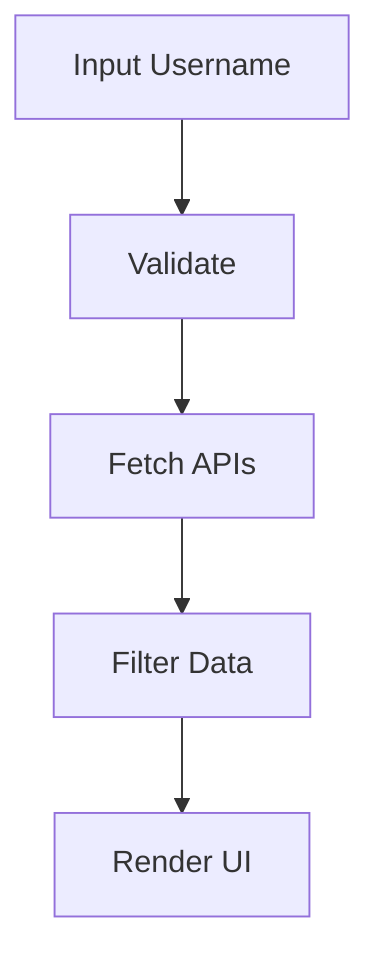

# 🧟 ZombAI Digital — Chrome Extension

<p align="center">
  
  
  
  
</p>

<p align="center">
  <b>Intelligent projects · built to learn</b>
</p>
```
███████╗ ██████╗ ███╗   ███╗██████╗       █████╗ ██╗
╚══███╔╝██╔═══██╗████╗ ████║██╔══██╗     ██╔══██╗██║
  ███╔╝ ██║   ██║██╔████╔██║██████╔╝     ███████║██║
 ███╔╝  ██║   ██║██║╚██╔╝██║██╔══██╗     ██╔══██║██║
███████╗╚██████╔╝██║ ╚═╝ ██║██████╔╝     ██║  ██║██║
╚══════╝ ╚═════╝ ╚═╝     ╚═╝╚═════╝      ╚═╝  ╚═╝╚═╝
         IPL ORACLE · POWERED BY ZOMBAI · @balram3429
```
---

## 🚀 Overview

ZombAI is a **next-gen Chrome Extension (Manifest V3)** with a futuristic **retro-terminal UI** that lets you explore GitHub profiles and repositories with speed, style, and intelligence.

---

## 🎥 Preview

<p align="center">
  

</p>

---

## ✨ Features

- 🔍 GitHub Profile Fetcher (parallel API calls)
- ⚡ Advanced Repo Explorer with sorting & filtering
- 🎯 Keyword highlighting in repos
- 🧠 Smart state management
- 🧟 Explore mode with quick launch actions
- ⏱️ Live IST Clock (no external libs)

---

## 🎨 UI Highlights

- 🌌 Deep space dark theme  
- 🖥️ CRT scanline overlay  
- ⚡ Neon glow accents  
- 🧬 Cyberpunk typography  

---

## ⚙️ Tech Stack

| Tech | Usage |
|------|------|
| Manifest V3 | Chrome extension architecture |
| Vanilla JS | Core logic |
| Chrome Storage API | Input persistence |
| GitHub REST API | Data source |

---

## 🔌 API Endpoints

```bash
GET https://api.github.com/users/{username}
GET https://api.github.com/users/{username}/repos
```

---

## 🧠 Core Flow



---

## 🛠️ Installation

```bash
git clone https://github.com/your-username/zombai-extension.git
```

- Open Chrome → Extensions  
- Enable Developer Mode  
- Click **Load Unpacked**  
- Select project folder  

---

## 📌 Roadmap

- [ ] GraphQL integration  
- [ ] Repo analytics dashboard  
- [ ] Offline caching  
- [ ] Multi-user compare  

---

## 🤝 Contributing

Pull requests are welcome!  
Open an issue before major changes.

---

## 📜 License

MIT License

---

## 👨‍💻 Author

**Balram Tiwari**  
🔗 https://github.com/balram3429  

---

## 🧟 Philosophy

> Build. Learn. Evolve. Repeat.
